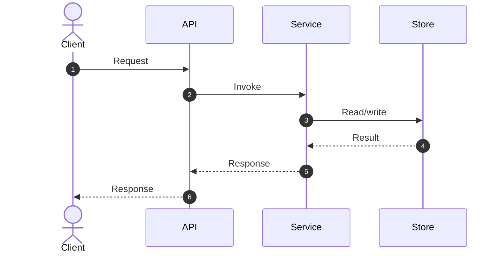

# Workflow: [name]

## Trigger

## Main flow

## Failure paths

## Diagram

```mermaid
sequenceDiagram
    autonumber
    actor Client
    participant API
    participant Service
    participant Store
    Client->>API: Request
    API->>Service: Invoke
    Service->>Store: Read/write
    Store-->>Service: Result
    Service-->>API: Response
    API-->>Client: Response
```

Replace every example participant and message with repository-verified evidence.

## Sources
